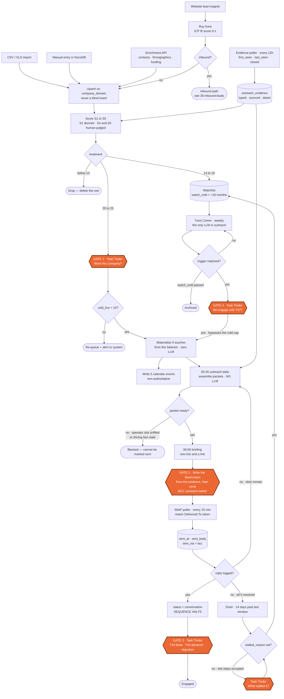
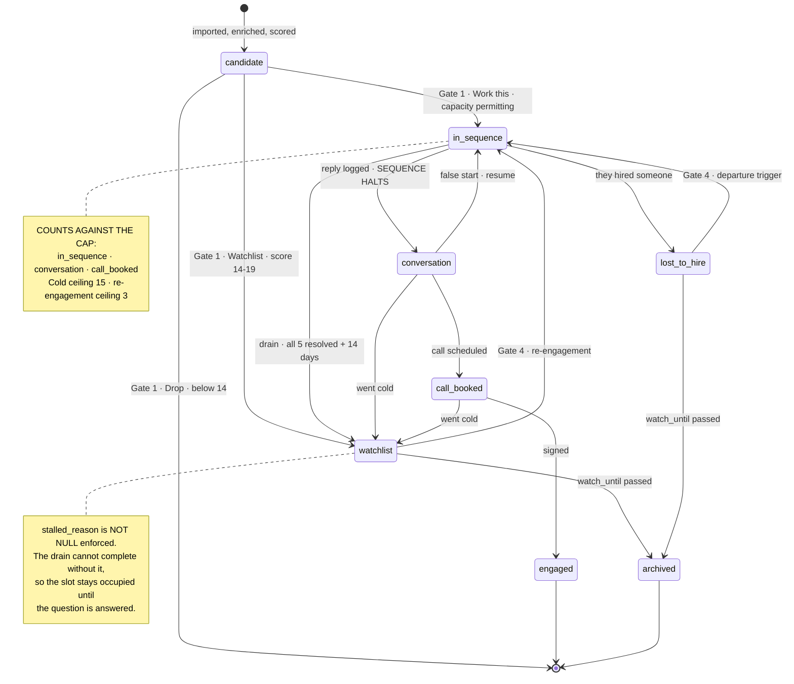
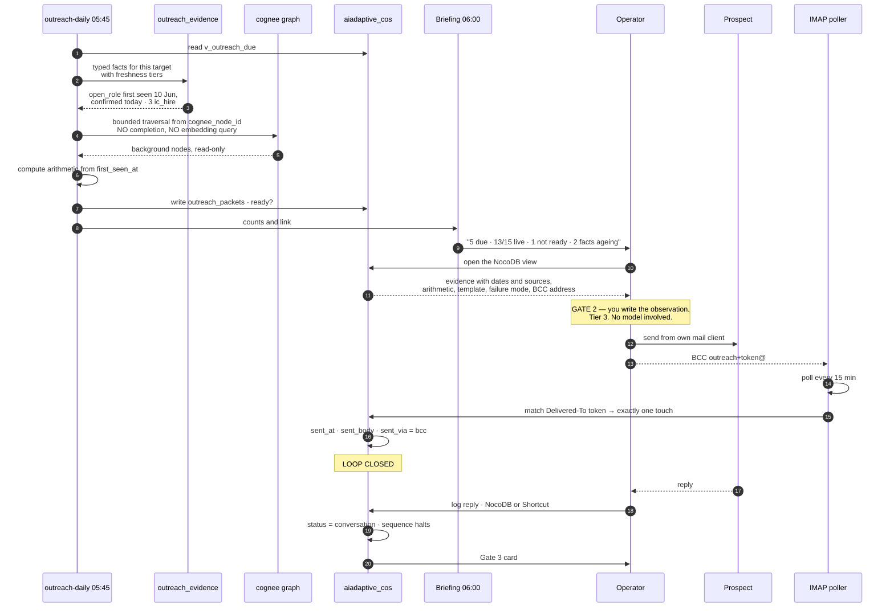
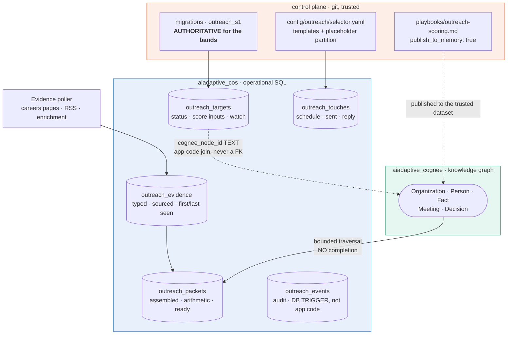
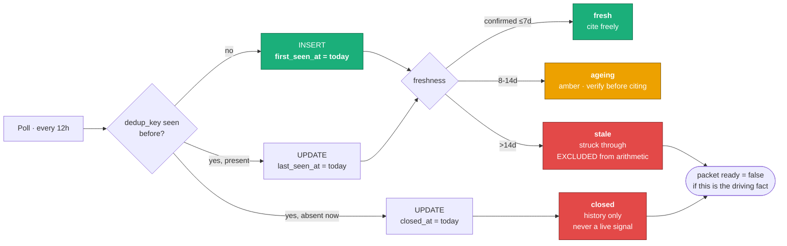

# Outreach Workflow — the map

<doc:layer>bridge — the workflow as a picture</doc:layer>
<doc:stability>medium — regenerate when 35- changes materially</doc:stability>
<doc:version>0.2.0</doc:version>
<doc:depends_on>35-outreach-crm.md, 36-inbound-leads.md</doc:depends_on>
<doc:referenced_by>90-workflows.md</doc:referenced_by>

## Purpose

`35-outreach-crm.md` is the specification and it is dense. This file is the map.
**Read this first, then go to 35- for the detail.**

Nothing here is new. If this document and `35-` disagree, `35-` is correct.

<changelog>

**0.2.0** — reflects the generation removal. **D6 (the injection surface) is
deleted** — there is no generated text in the system's outbound path, so the
diagram has no subject. It is replaced by **D6: the evidence lifecycle**, which is
where the risk actually moved: freshness. D3 loses the model call. D5 gains the
evidence table. Gate 2 changes from *read the packet* to *write the observation*.

</changelog>

<legend>

| Shape / mark | Meaning |
|--------------|---------|
| Rectangle | Automated step — Tier 1, no human |
| Diamond | Branch evaluated by the system |
| Rounded, thick border | **Human decision — Tier 2 or 3** |
| Cylinder | Persisted state |

Four human gates exist in the whole system. Everything else runs unattended.
**One LLM call remains** in outreach — Trent Crimm's trigger classification — and
it never touches outbound text.

</legend>

---

## 1. End to end

<diagram id="D1" name="End to end">

</diagram>

**The four gates, and nothing else.** Gate 1 admits a company. Gate 2 is writing the
observation and sending. Gate 3 routes a reply. Gate 4 re-engages from the
watchlist. Every other box runs without you.

**The evidence poller feeds two things** — the score, and the packet. It is the only
component that must start early, because `first_seen_at` accrues forward and cannot
be bought retroactively.

**Where it deadlocks if you remove a piece.** Take out the drain and the capacity
gate blocks all intake permanently. Take out `stalled_reason` enforcement and the
watchlist becomes a list of companies you cannot re-engage, because T49 needs to
know what stalled.

---

## 2. Target status — the state machine

<diagram id="D2" name="Status state machine">

</diagram>

Three statuses consume capacity, not one. A booked call still occupies a slot,
because it still occupies your attention — which is what the cap actually meters.

---

## 3. One touch, closed

<diagram id="D3" name="Closing the loop on a single touch">

</diagram>

**No LLM appears in this sequence.** Packet assembly is a deterministic query, so it
cannot fail from a provider outage and does not depend on cognee's completion path.

**Matching is on the BCC token**, never a heuristic. Recipient plus subject plus
nearest-due-date mis-attributes on an early send or two contacts at one company, and
that corrupts touch-of-first-reply silently.

**The LinkedIn hole.** Steps 12–15 do not exist for a LinkedIn send. That path
closes through the Apple Shortcut or NocoDB, permanently, not transitionally.

---

## 4. The arc — five windows anchored on the trigger

```mermaid
flowchart LR
    T(["trigger_date<br/>day 0"]) --> S1
    S1["Slot 1 · Recognition<br/>days 0-7 · due 3<br/><b>no ask at all</b>"] --> S2
    S2["Slot 2 · Relevance<br/>days 7-14 · due 10<br/>tie to their use of funds"] --> S3
    S3["Slot 3 · Proof<br/>days 14-30 · due 21<br/>narrow proof, one number"] --> S4
    S4["Slot 4 · The bridge<br/>days 30-45 · due 37<br/><b>the only direct ask</b>"] --> S5
    S5["Slot 5 · Close the loop<br/>days 60-90 · due 75<br/><b>highest converting</b>"] --> D["Drain<br/>+14 days"]

    style S1 fill:#2a78d6,stroke:#123c6d,color:#ffffff
    style S2 fill:#2a78d6,stroke:#123c6d,color:#ffffff
    style S3 fill:#2a78d6,stroke:#123c6d,color:#ffffff
    style S4 fill:#eb6834,stroke:#7a2f10,color:#ffffff
    style S5 fill:#eb6834,stroke:#7a2f10,color:#ffffff
```

<diagram id="D4" name="The five-touch arc">

</diagram>

**Every window is measured from `trigger_date`, never from the previous send.**
That is why snoozing one touch never shifts the others, and why a snooze may not
cross into the next slot's window.

**S1 scoring rides this same axis and is non-monotonic:** 5 inside day 14, 3 through
the middle, **5 again across days 58–68** — the day-60 hinge, which is slot 5's
window — then 1 past day 90. A naive "older is worse" ladder deletes the
highest-converting moment in the method.

---

## 5. Where the data lives

<diagram id="D5" name="Storage split">

</diagram>

**Operational state is SQL. Knowledge is graph. Instructions are git.** The three
never share a store, and the graph never mints an instruction — that separation *is*
the security model (B1, B4).

**Why evidence is SQL and not graph.** The packet needs *"the VP Revenue req, first
seen 10 June, still open today"* — an exact, dated, ordered fact. That is a
relational query. The graph holds what a transcript said; the evidence table holds
what was observed and when.

**The S1 bands exist in the migration and in playbook prose. The migration wins.**

---

## 6. The evidence lifecycle — where the risk moved

<diagram id="D6" name="Evidence lifecycle and freshness">

</diagram>

**This diagram replaces the injection surface.** With no generated text in the
outbound path, prompt injection has no subject — and the risk that took its place is
**staleness**.

A req that closed three weeks ago, displayed as "open 56 days," produces an email
that is specific, confident, and wrong. Worse than an odd sentence, because the
recipient can check it in one click. T10's own copy hedges it — *"Posted about [X]
weeks ago, if I am reading the date right"* — because the author knew.

**`first_seen_at` is the proprietary datum.** No provider reliably sells "when did
this req first appear"; you create it by watching. Which is why the evidence poller
should start before anything else — two weeks of polling is two weeks of
posting-age data that cannot be bought retroactively.

**The residual injection risk is low but not zero.** Crafted text in a job posting,
displayed verbatim and copied by a human, still reaches a prospect. The controls are
typed short fields with a 500-character excerpt cap, unicode stripping at ingest,
and always showing the source URL and date — `35-` §11, H1 and H2.

---

## 7. What is deliberately not here

- **Generated prose.** Removed in `35-` v0.3.0. The system assembles evidence; you
  write the sentence. One LLM call remains in outreach — Trent Crimm's trigger
  classification — and it never touches outbound text.
- **Inbound handling** — `36-inbound-leads.md`. The constraint is settled (inbound
  never runs the cold arc); the design is open, gated on measuring actual volume.
- **Departure detection** — flagged open in `35-` OQ1. No legitimate automated path;
  the careers-page proxy ships regardless, and no scraper is built.
- **`#outreach-today`** — dropped. The briefing carries one line and a link; the
  NocoDB view is the work surface. Every invariant it would have enforced is now a
  database constraint.
